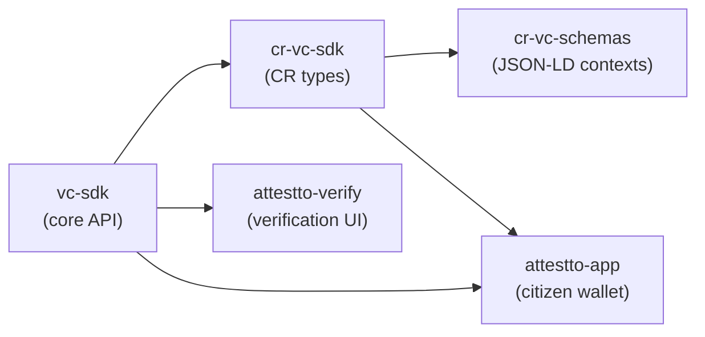

# vc-sdk

[](https://www.npmjs.com/package/@attestto-com/vc-sdk)

> Universal W3C VC Data Model v2.0 TypeScript SDK

`@attestto-com/vc-sdk` is a foundational SDK for issuing and verifying Verifiable Credentials with zero native dependencies. Implements the full [W3C VC Data Model v2.0](https://www.w3.org/TR/vc-data-model-2.0/) specification. Designed to be extended by domain-specific credential packages via a pluggable schema system. For full documentation, see [attestto.org/docs](https://attestto.org/docs).

## Architecture



## Quick start

### Prerequisites

- Node ≥ 18
- npm or yarn

### Install

```bash
npm install @attestto/vc-sdk
```

### Try it

```typescript
import { VCIssuer, VCVerifier, generateKeyPair } from '@attestto/vc-sdk'

// Generate keys (Ed25519 or ES256)
const keys = generateKeyPair()

// Create an issuer
const issuer = new VCIssuer({
  did: 'did:web:my-org.attestto.id',
  privateKey: keys.privateKey,
})

// Issue any credential — no type constraints
const vc = await issuer.issue({
  type: 'UniversityDegree',
  context: 'https://schemas.example.org/education/v1',
  subjectDid: 'did:web:student.attestto.id',
  claims: {
    degree: {
      name: 'Computer Science',
      level: 'Bachelor',
      university: 'Universidad de Costa Rica',
    },
  },
})

// Verify
const verifier = new VCVerifier()
const result = await verifier.verifyWithKey(vc, keys.publicKey, 'Ed25519', {
  expectedType: 'UniversityDegree',
  expectedIssuer: 'did:web:my-org.attestto.id',
})
console.log(result.valid) // true
```

## API

### VCIssuer

```typescript
const issuer = new VCIssuer(config: IssuerConfig)
issuer.use(plugin: SchemaPlugin)          // Register domain schemas
const vc = await issuer.issue(options)     // Issue a signed VC
```

Core responsibilities: sign VCs with Ed25519 or ES256, manage DID/keyId, auto-inject schema context and property mapping via plugins.

### VCVerifier

```typescript
const verifier = new VCVerifier(config?: VerifierConfig)
const result = await verifier.verify(vc, options?)
const result = await verifier.verifyWithKey(vc, publicKey, algorithm, options?)
```

Validates signatures, expiration, proof format, and custom constraints. Returns `{ valid, checks, errors, warnings }`.

### generateKeyPair

```typescript
const keys = generateKeyPair('Ed25519' | 'ES256')
// keys.publicKey: Uint8Array
// keys.privateKey: Uint8Array
// keys.algorithm: string
```

Generate cryptographic key pairs for issuance and verification.

### SchemaPlugin

```typescript
interface SchemaPlugin {
  context: string                    // JSON-LD context URL
  types: string[]                    // Credential types this plugin handles
  propertyMap?: Record<string, string>  // Map type → credentialSubject property
}
```

Register domain-specific schemas to auto-inject context and wrap claims:

```typescript
issuer.use({
  context: 'https://schemas.attestto.org/cr/driving/v1',
  types: ['DrivingLicense', 'TheoreticalTestResult'],
  propertyMap: {
    DrivingLicense: 'license',
    TheoreticalTestResult: 'theoreticalTest',
  },
})

// Now issue — context and property wrapping are automatic
const vc = await issuer.issue({
  type: 'DrivingLicense',
  subjectDid: 'did:web:maria.attestto.id',
  claims: { licenseNumber: 'CR-2026-045678', categories: ['B'] },
})
```

## Ecosystem

Full index: [Attestto-com/attestto-open](https://github.com/Attestto-com/attestto-open)

| Repo | What |
|---|---|
| [vc-sdk](https://github.com/Attestto-com/vc-sdk) | This — universal VC SDK |
| [cr-vc-sdk](https://github.com/Attestto-com/cr-vc-sdk) | CR-specific SDK (TypeScript, typed wrappers) |
| [cr-vc-sdk-dotnet](https://github.com/Attestto-com/cr-vc-sdk-dotnet) | CR-specific SDK (.NET 8) |
| [cr-vc-schemas](https://github.com/Attestto-com/cr-vc-schemas) | CR driving schemas (11 types) |
| [did-sns-spec](https://github.com/Attestto-com/did-sns-spec) | did:sns DID method spec |
| [did-sns-resolver](https://github.com/Attestto-com/did-sns-resolver) | Universal Resolver driver for did:sns |
| [id-wallet-adapter](https://github.com/Attestto-com/id-wallet-adapter) | Wallet discovery protocol |

## License

Apache 2.0
